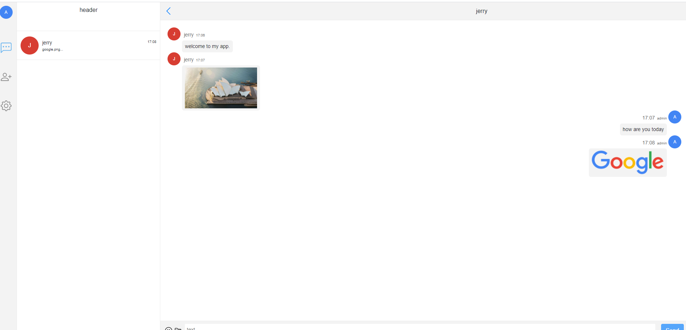

# [Achat](http://duduanan.com)

 
 
 
 
 
 
 
 
 AChat is built based on web and used to do instant talk with friends. 
 
 
 ### How to start
 * run mysql script under mysq folder.
 * start achat back-end spring boot app under back-end folder
 * start react built front-end by npm start command under front-end folder
 * sign up a new user and login the app
 

##### You can login in our [online demo app](http://duduanan.com) at any time with test account:
  > username: **admin**  
  > password: **admin**

### Screen shot
<table>
	<tr>
    <td></td>
    </tr>
</table>

### final
if you like the project, please give a star.
any questions, please contact me at ***jerryguowei@gmail.com*** 
